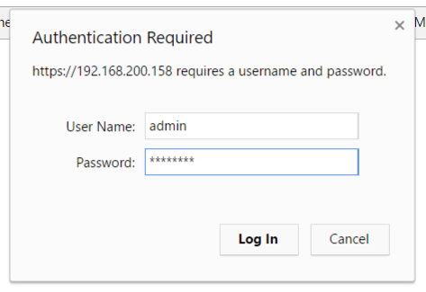
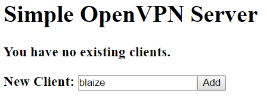
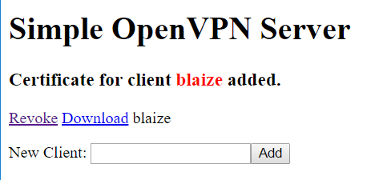

Simple OpenVPN Server
====

OpenVPN is a one of the most popular VPN platforms for a lot of good reasons. It's free, open source, and there are clients for just about every platform imaginable. For these reasons, OpenVPN is the choice for organizations and individuals alike. 

There are dedicated appliances for OpenVPN that work well for enterprises, but for smaller organizations and individuals, these are overkill.  This little project grew out of a desire to create a simple, web based UI for managing OpenVPN while as well as creating a fully automated installer of the the software on a rather lower-powered Linux host, such as an entry level VM on Azure, a Virtual Private Server (VPS) or even a container.

A special thanks goes out to the folks behind [openvpn-install](https://github.com/Nyr/openvpn-install) for their wonderful project, which serves as an interactive installer on the command line. Much of the heavy lifting for the installer here is from the script there. 

The scripts assumes that there is NOT an instance of OpenVPN already installed on the machine and that port 443 is not in use by another web server for HTTPS. Likewise, this script was built for Redhat 6+ and current Debian/Ubuntu distros.


## Installing OpenVPN

Optionally, you can do a completely automated deployment to Azure and skip past the installation to **Managing Clients**.

<a href="https://portal.azure.com/#create/Microsoft.Template/uri/https%3A%2F%2Fraw.githubusercontent.com%2Ftheonemule%2Fsimple-openvpn-server%2Fmaster%2Fopenvpn-template.json" target="_blank"></a>

Otherwise, use the installer:

1. Pull up a terminal or SSH into the target server.

1. Logon as root

	````
	sudo -i
	````

1. Download the installer script.

	````
	wget https://raw.githubusercontent.com/theonemule/simple-openvpn-server/master/openvpn.sh
	````

1. Make the script executable

	````
	chmod +x openvpn.sh
	````

1. Run the script.

	````
	./openvpn.sh [options]
	````

	Example:

	````
	./openvpn.sh --adminpassword=mypassword --host=myvpn.example.com
	````


	There are number of options the script will accept

	**adminpassword** -- This is the admin password for the website for managing clients. The default is **password**.

	**dns1** -- The first dns server assigned to the clients. The default is **8.8.8.8**.

	**dns2** -- The first dns server assigned to the clients. The default is **8.8.4.4**.

	**vpnport** -- The port to be used by OpenVPN. 1194 may be blocked by some firewalls, so this is customizable. The default port is **1194**.

	**protocol** -- The protocol to be used by OpenVPN. This accepts **udp** or tcp. The default is **udp**.

	**host** -- The host name of the server. The script attempts to detect the external IP of your server if the host is not specified. ***It is highly recommended that you use a host name if your sever is not using a static IP address***. You can get a free dynamic DNS account and use a dynamic DNS updater that keeps the DNS records for your server up to date in the event that your IPa address changes.

1. Let the installer finish. This may take a few minutes, as the intaller generates a few keys to set up a certificate authority (CA) that is used to assign certificates to the clients.

1. If the server you are installing this on is behind a firewall, be sure that you forward the external ports from the firewall to the ports on the server for the VPN. Optionally, if you want to be able to manage the VPN from outside the firewall, forward a port to 443 on the VPN Server.


## Managing Profiles

1. Once the script is complete, point your browser to **https://[your host or IP]/**, where your host or IP is the host name or IP addressed for the VPN. You may get an error about the site not being secure even though you are using https. This is because the site is using a self-esigned certificate. Simply ignore the warning. 

1. Logon to the admin site. Use **admin** for the username and the password used for the **adminpassword** option when the installer was run. If you did not supply one, use **password**.

	

1. Once logged on, enter a name for the client and click **Add**.

	

1. Once added, you can click **Revoke** to revoke access or **Download** to download the client profile. 

	

## Connecting to the Server

Once the profile is downloaded you need to configure a client:

* **Windows**: use [OpenVPN GUI](https://openvpn.net/index.php/open-source/downloads.html). After installing the app, copy the .ovon to the **C:\Program Files\OpenVPN\config** folder. Launch the GUI from your Start menu, then right click the icon in the Tool Tray, then click **Connect**. Disconnect by right clicking and selecting **Disconnect**.

* **MacOS** (OS X): use [Tunnelblick](https://tunnelblick.net/downloads.html). Download and install Tunnelblick. After downloading, double-click on the downloaded .ovpn file and import the configuration either for yourself or all users. Once imported, click the Tunnleblick icon on the menu bar and click **Connect**. Disconnect by clicking the Tunnelblick icon and selecting **Disconnect**.

* **Android**: use [OpenVPN Connect for Android](https://play.google.com/store/apps/details?id=net.openvpn.openvpn&hl=en). Download and install the app. Next, go to the admin site and create and/or download a profile. In the app, select Import from the menu, then select **Import**, then select **Import Profile from SD card**. Find the profile in your **Downloads** folder and import the profile. Once downloaded, click **Connect**. To disconnect, open the app again and select **Disconnect**.

* **iOS**: use [OpenVPN Connect for iOS](https://itunes.apple.com/us/app/openvpn-connect/id590379981?mt=8). Install the app, then browse to the admin site in Safari. Create and/or download a profile. After the profile is downloaded, select **Open in Open VPN**. Install the profile, then select **Connect** to connect to the VPN. To disconnect, open the app again and select **Disconnect**.

That's it! Your VPN is up and running.
